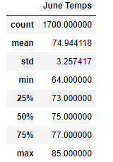
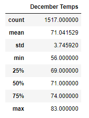

# Surfs-up

## Project Overview

W. Avy is a potential investor who requested some weather statistical data to help him decide whether he should invest or not invest in Surf n’ Shake, an ice cream and surfing business based in Oahu, Hawaii.

To help with the decision making, the following data was pulled:

-	Summary statistics for the amount of precipitation in a year
-	Number of stations used to collect the information
-	Most active stations
-	Low, high, and average temperatures

The data seemed to be indicating that investing in Surf n’ Shake could be a good idea; however, W. Avy needed one more analysis.

### Purpose

The purpose of this analysis is to provide summary statistics of the temperature data for the months of June and December in Oahu to determine if the surf and ice cream shop business is sustainable year-round.

## Results

- **Count:** There are less data points for the month of December. June had 1,700 while December had 1,517.
- **Mean:** The average temperature is almost four degrees higher in June than December. Mean temperature during all the observed years in June was 75°F while in December was 71°F.
- **Min and Max:** There is not a significant difference in the maximum temperature between June and December (85°F in June vs. 83°F in December). However, December had a minimum temperature of 56°F while the minimum temperature in June was 64°F. 

Below is a screenshot of the summary statistics for both months:

    

## Summary

The results of this analysis indicate that June and December have a favorable weather to have an ice cream and surfing business in Oahu, Hawaii, because the temperature patterns seem consistent throughout the year. Additionally, the data has a relatively low standard deviation, meaning small spread across the temperature data.
Both months have an average temperature above the 70 degrees Fahrenheit, indicating a warmer weather. Despite December having a minimum temperature below the 60 degrees, the maximum is still above 80°F. 

Additional queries that one can run are statistics regarding precipitation for the month of June and for the month of December. This is important because rain could negatively impact sales in the business even if temperatures are high. Finding these results can be done relatively quickly by refactoring the code previously used to find temperature statistics. 

